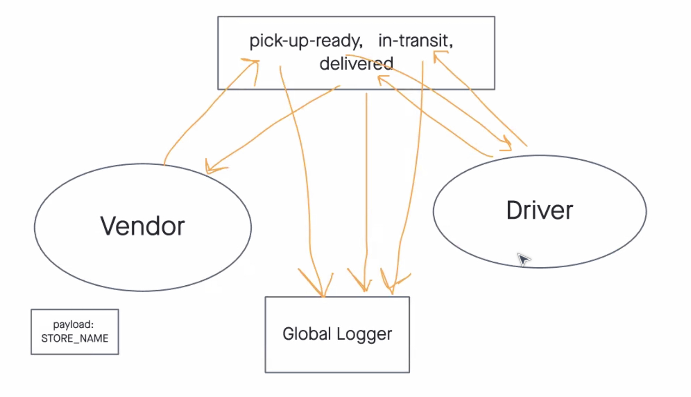

## Everything Events

## Approach to refactoring  

Global Event Pool (HUB)

    Use the socket.io npm package to configure an event Server that can be started at a designated port using node.
        Accept connections on a namespace called caps, and configure socket objects from clients.
        Ensure that client sockets are connecting to their approriate room if specified.
    Configure a Global Event Pool that every client socket should listen for:
        pickup - this will be broadcast to all sockets.
        in-transit - this will be emitted only to Vendors that have joined the appropriate room.
        delivered - this will be be emitted only to Vendors that have joined the appropriate room.

            NOTE: You may need to create an extra event here that allows clients to join “rooms”.

Vendor Client Application

    Connects to the CAPS Application Server using socket.io-client:
        Make sure your module connects using the caps namespace.
        Upon connection, use a Vendor ID to join a room, this can be a store name.
    Upon connection, simulate a new customer order:
        Create a payload object with your store id, order id, customer name, address.
        Emit that message to the CAPS server with an event called pickup.
    Listen for the delivered event coming in from the CAPS server.
        Log “thank you for delivering payload.id to the console.
    After the delivery event has been received, exit the application using process.exit().

Driver Client Application

    Connects to the CAPS Application Server using socket.io-client:
        Make sure this module is using the caps namespace to connect to the Server.
    Once connected, the Driver client module should listen for any appropriate events from the Server:
        When a pickup is emitted from the Server, simulate all specified Driver behaviors.
    Simulate the following events and emit payloads to the CAPS Application Server upon receiving a “pickup” event:
        in-transit
            Log “picking up payload.id” to the console.
            emit an in-transit event to the CAPS server with the payload.
        delivered
            emit a delivered event to the CAPS server with the payload.

When running, the vendor and driver consoles should show their own logs. Additionally, the CAPS server should be logging everything.